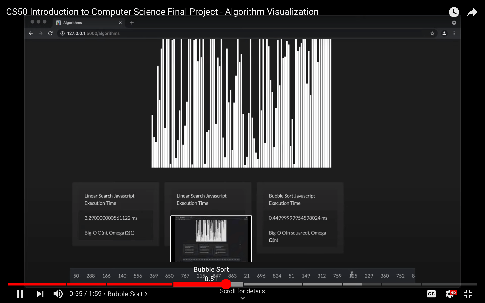

# [Algorithms Visualizer: Front-End Web App using D3](https://dsa-visualization.herokuapp.com/)
[](https://codeclimate.com/github/JacobGrisham/Data-Structures-and-Algorithms-Visualizer/maintainability)
[](https://www.codacy.com/gh/JacobGrisham/Data-Structures-and-Algorithms-Visualizer/dashboard?utm_source=github.com&amp;utm_medium=referral&amp;utm_content=JacobGrisham/Data-Structures-and-Algorithms-Visualizer&amp;utm_campaign=Badge_Grade)
[](https://app.circleci.com/pipelines/github/JacobGrisham/Data-Structures-and-Algorithms-Visualizer)
## Final Project from [Harvard's Introduction to Computer Science CS50 hosted on eDX](https://www.edx.org/course/cs50s-introduction-to-computer-science)
## 🎓 [Final Project](https://cs50.harvard.edu/x/2020/project/)
-   The climax of this course is its final project. I chose to create a web-based searching and sorting algorithms visualization tool.
-   My project video submission is hosted on CS50's [Gallery of Final Projects](https://cs50.harvard.edu/x/2021/gallery/)

## ▶️ Walkthrough on Youtube
[](https://youtu.be/rSeSffuw4Tg)

## 🖥 [Live Application(https://dsa-visualization.herokuapp.com/)]

## 💡Lessons Learned
-   Searching and Sorting Algorithms
-   D3 Data Visualization
-   Asynchronous Javascript
## 🛠 Technologies
|Front-End|Back-End|
| ------- | ------ |
|HTML5	  |Flask   |
|CSS3		  |Python  |
|Bootstrap 4|.     |
|Javascript|.		   |
|D3       |.       |

## ⚖️ Methodology
-   D3 Library for data visualization to both challenge myself with learning a new framework and because D3 is the ideal solution for data visualization problems
-   Bootstrap 4 for increasing my experience working with it and to shift focus towards spending more time on the data visualization and underlying algorithms
## ⚙️ Features
-   Visualize Linear Search, Binary Search, Bubble Sort, Selection Sort, Merge Sort, and Insertion Sort
-   Random numbers in an array are graphed as a bar chart
-   The values of the array are displayed and updated in an HTML table below the bar chart
-   They are also accessible through a tooltip that displays the value when hovered over
-   The Javascript Execution times are logged in Bootstrap 4 cards to allow comparison of different algorithm runtimes and for further information on the Big-O

To Do:
-   Add unit testing
-   Allow user to specify the speed they want the algorithm to run
-   Add more algorithms as I progress in my studies
-   Expand upon the scope by incorporating data structure visualization and manipulation
## 🚀 Getting Started
To run this project locally:
-   In your terminal, navigate to the root project directory and run the following commands
-   Activate the virtual environment
```
$ pipenv shell
```
-   To install the dependencies
```
$ pip install Flask
$ pipenv install Flask
```
-   To start the web server, execute (without debugging):
```
$ python app.py 
```
-   Alternatively, execute (without debugging):
```
$ export FLASK_APP=application.py
$ flask run
```
## 📐 Tests
-   Add unit testing
## 🔒 License
Copyright Notice and Statement: currently not offering any license. Permission only to view and download.